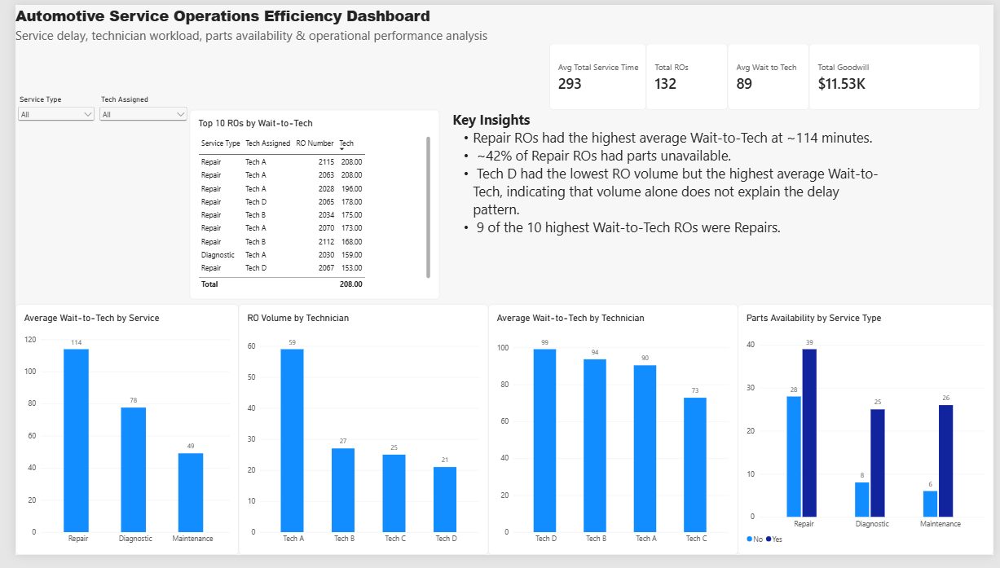

# automotive-service-operations-analysis
Operations analytics project analyzing automotive service delays, technician workload, parts availability, and service performance using Excel, SQL, and Power BI.
# Automotive Service Operations Efficiency Analysis

## Project Overview

This project analyzes a synthetic automotive service operations dataset to identify factors associated with customer wait times, service duration, technician workload, parts availability, and operational performance.

The objective is to answer a practical operations question:

> How can an automotive service operation identify service bottlenecks and reduce customer wait times while maintaining operational efficiency?

The project uses **Excel, SQL, and Power BI** to move from exploratory analysis to an interactive management dashboard.

> **Note:** All data used in this project is synthetic and was created specifically for portfolio and learning purposes. It does not contain real customer, employee, or employer data.

## Tools Used

- Microsoft Excel — data validation, calculated fields, PivotTables, and exploratory analysis
- SQL — KPI validation, grouped analysis, operational segmentation, and outlier identification
- Power BI — DAX measures, interactive dashboard development, filtering, and visualization

## Key Metrics

- Total Repair Orders: 132
- Average Wait-to-Tech: 89.1 minutes
- Average Total Service Time: 293 minutes
- Total Goodwill: approximately $11.53K

## Key Findings

- Repair ROs recorded the highest average Wait-to-Tech at approximately **114 minutes**, compared with approximately **78 minutes for Diagnostic** and **49 minutes for Maintenance**.
- Approximately **42% of Repair ROs** had parts unavailable.
- Technician workload alone did not explain the observed wait-time pattern. Tech D handled the lowest RO volume but had the highest average Wait-to-Tech.
- **9 of the 10** highest Wait-to-Tech ROs were Repair orders.
- The findings suggest that service mix, job complexity, parts availability, and workload allocation should be investigated together rather than attributing delays to a single factor.

## Analysis Workflow

1. Validated and explored the synthetic dataset in Excel.
2. Created operational metrics including Wait-to-Tech, Total Service Time, and FRT Variance.
3. Used PivotTables to investigate service type, technician workload, and parts availability.
4. Reproduced and validated major findings using SQL.
5. Created DAX measures and an interactive Power BI dashboard.
6. Identified operational patterns and developed management-focused recommendations.

## Dashboard

## Dashboard

The interactive Power BI dashboard provides a management-level view of service performance, including customer wait times, service duration, technician workload, parts availability, and high-delay repair orders.

## Recommendations

Based on the analysis:

- Prioritize investigation of Repair ROs because they show the greatest concentration of elevated Wait-to-Tech.
- Evaluate technician workload together with service complexity rather than using RO count alone.
- Review parts planning and availability for Repair work.
- Monitor high-delay ROs individually to identify recurring operational causes.
- Test operational changes through controlled pilots and compare Wait-to-Tech, total service time, WIP, and throughput before wider implementation.

## Repository Structure

- `data/` — synthetic service operations dataset
- `sql/` — SQL analysis queries
- `excel/` — Excel analysis workbook
- `dashboard/` — Power BI dashboard
- `images/` — dashboard screenshots

## Disclaimer

This is an independent portfolio project using synthetic data. It is not affiliated with, endorsed by, or based on confidential data from any automotive manufacturer, service center, or employer.
